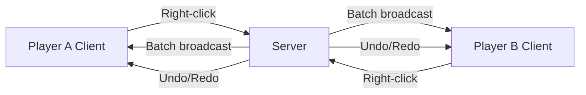

# Multiplayer

Pushdozer fully supports multiplayer. All terrain operations execute on the server and sync to every online player.

## Architecture

- **Server-authoritative**: All block changes execute on the server thread
- **Batch sync**: Terrain changes broadcast via optimized network packets
- **Independent config**: Each player's work mode, brush, height settings, etc. are stored locally
- **Independent undo**: Each player has their own 30-step undo/redo history

## Key Features

### Terrain Sync

- All operations (excavate, place, smooth, plant, etc.) sync in real time
- Small operations (≤50 blocks) send immediately
- Large operations use a batch queue: up to 500 blocks per batch, 100ms delay
- Undo/redo also syncs to all clients

### Permissions

- **All players can use Pushdozer by default** — no special permissions needed
- Brush size capped at 64 blocks (server-side validation)
- Compatible with area protection plugins (e.g., WorldGuard)
- Extensible custom permission system supported

### Independent Config

Each player can independently configure:

- Work mode and sub-parameters
- Brush geometry and size
- Height mode
- Display mode and operation distance
- Block filter lists

Config is saved locally at `config/pushdozer_config.json` and does not sync to the server or other players.

## Multiplayer Tips

### Collaboration

1. Announce large operations in chat before starting
2. Avoid multiple players operating in overlapping areas simultaneously
3. Agree on area assignments to reduce conflicts
4. Back up the world before major terrain changes

### Performance

1. Control brush size to avoid affecting too many blocks at once
2. Stagger large operations across time
3. Increase operation range on well-configured servers
4. Switch to **None** display mode if experiencing lag

## Troubleshooting

### Changes not syncing

1. Check network connection stability
2. Restart client or rejoin the server
3. Check server logs for network errors

### Tool not responding

1. Confirm you're not in a protected area
2. Check brush size is within allowed range (1–64)
3. Try relogging

### Server lag

1. Reduce simultaneous operators
2. Lower brush sizes
3. Split large projects into smaller operations

## Server Administrators

Pushdozer requires no additional server configuration. To restrict usage:

1. Use area protection plugins to block modifications in specific regions
2. Extend `OperationPermissions` to integrate LuckPerms or similar
3. Monitor server logs for Pushdozer operation records

For technical details, see [MULTIPLAYER_SUPPORT.md](https://github.com/theopote/pushdozer/blob/main/docs/MULTIPLAYER_SUPPORT.md) in the mod repository.
