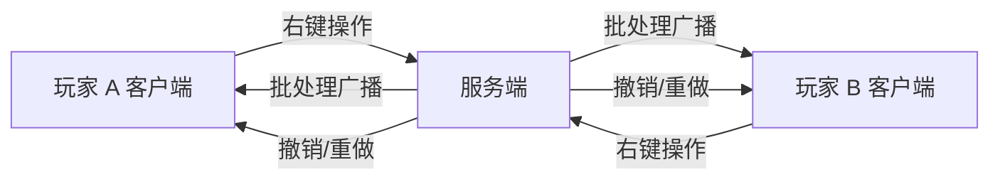

# 多人游戏

Pushdozer 完全支持多人联机。所有地形操作在服务端执行并同步到每位在线玩家。

## 架构概述

- **服务端权威**：所有方块修改在服务端线程执行
- **批处理同步**：地形变更通过优化的网络包广播给所有客户端
- **独立配置**：每名玩家的工作模式、笔刷、标高等设置保存在本地，互不影响
- **独立撤销**：每名玩家拥有自己的 30 步撤销/重做历史

## 主要特性

### 地形操作同步

- 挖掘、铺设、平滑、种植等所有操作实时同步
- 小操作（≤50 方块）立即发送
- 大操作使用批处理队列，每批最多 500 方块，100ms 延迟
- 撤销/重做操作同样同步到所有客户端

### 权限

- **默认所有玩家可用**，无需特殊权限
- 笔刷尺寸上限为 64 格（服务端校验）
- 可与区域保护插件（如 WorldGuard）配合使用
- 支持扩展自定义权限系统

### 独立配置

每位玩家可独立设置：

- 工作模式与子参数
- 笔刷几何体与尺寸
- 标高模式
- 显示模式与操作距离
- 方块过滤列表

配置保存在客户端 `config/pushdozer_config.json`，不会同步到服务器或其他玩家。

## 多人使用建议

### 协作规范

1. 大范围操作前在聊天中通知队友
2. 避免多名玩家同时在重叠区域操作
3. 商定各自负责的区域，减少冲突
4. 重要地形修改前先备份世界

### 性能建议

1. 控制笔刷尺寸，避免单次操作影响过多方块
2. 错开大规模操作时间
3. 服务器配置较好时可适当增大操作范围
4. 遇到卡顿时减小笔刷并切换为 **不显示** 模式

## 故障排除

### 操作不同步

1. 检查网络连接稳定性
2. 重启客户端或重新加入服务器
3. 查看服务器日志中的网络错误

### 工具不响应

1. 确认不在区域保护范围内
2. 检查笔刷尺寸是否在允许范围（1–64）
3. 尝试重新登录

### 服务器延迟

1. 减少同时操作的人数
2. 降低笔刷尺寸
3. 将大范围工程拆分为多次小操作

## 服务器管理员

Pushdozer 无需额外服务端配置即可运行。如需限制使用范围，可：

1. 通过区域保护插件限制特定区域的方块修改
2. 扩展 `OperationPermissions` 集成 LuckPerms 等权限系统
3. 监控服务器日志中的 Pushdozer 操作记录

详细技术文档参见模组仓库中的 [MULTIPLAYER_SUPPORT.md](https://github.com/theopote/pushdozer/blob/main/docs/MULTIPLAYER_SUPPORT.md)。
